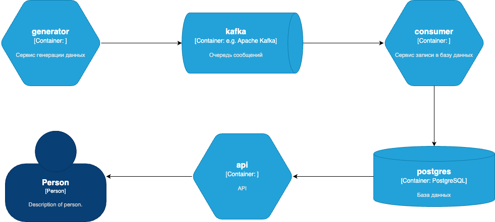
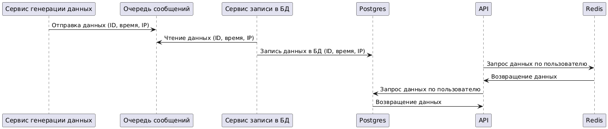
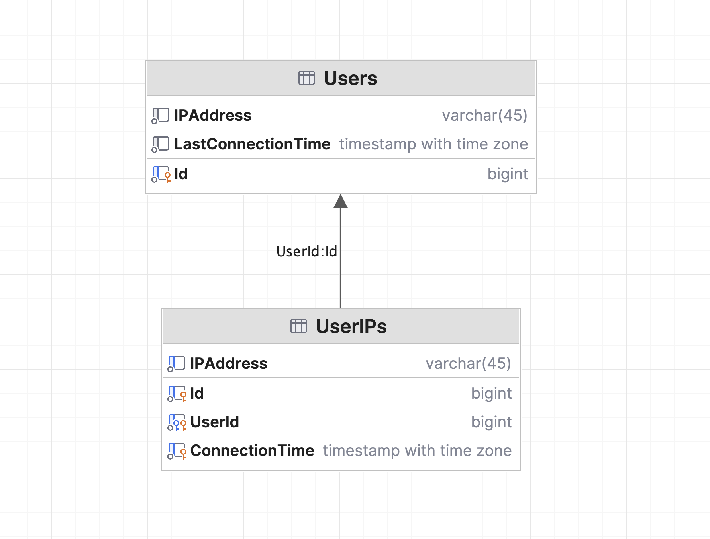

[](https://github.com/gardasar-code/lab-iplogs/actions/workflows/build.yml)

# Задача

Сервис для работы с пользователями и их IP адресов.
Сервис накапливает данные от источника событий о подключении пользователя со случайного IP адреса и сохраняет их в БД (
предпочтительно PostgreSQL). IP адреса в событии для каждого счета могут повторяться или могут быть новыми. Один
пользователь может подключаться с разных IP адресов, несколько пользователей могут подключаться с одного IP адреса.
Формат данных в событии (пользователь long, строка IP адреса) 100001, “127.0.0.1”

Сервис должен позволять:

- найти пользователей по начальной или полной части IP адреса (например, если в качестве строки поиска указать “31.214”,
  а у пользователя 1234567 зафиксированы ранее следующие IP ["31.214.157.141", "62.4.36.194"], то метод сервиса вернет
  список, в котором помимо прочих подходящих пользователей будет и 1234567)
- найти все накопленные IP адреса пользователя
- найти время и IP адреса последнего подключения пользователя

# Сервисы



- **Сервис генерации данных (generator)** — создает данные, содержащие ID пользователя, текущее время и IP-адрес.
  Генерирует массив из 10 IPv6 и 10 IPv4 адресов, которые случайным образом распределяет между 10 пользователями.
- **Очередь сообщений (Kafka)** — служит буфером для данных, созданных сервисом генерации, перед их отправкой в базу
  данных.
- **Сервис записи в базу данных (consumer)** — извлекает данные из очереди и записывает их в базу данных Postgres.
- **База данных (Postgres)** — хранит данные о пользователях.
- **Кэш (Redis)** — осуществляет кеширование данных из базы.
- **API** — предоставляет доступ к данным пользователей из базы данных через запросы.



# База данных



Для таблицы **UserIPs** используется партиционирование по месяцам. Для тестирования взяты предыдущий год, текущий и
следующий. Эти партиции дополнительно делятся на 10 частей по хешу пользователя.

Чтобы эффективно искать пользователей по начальной или полной части IP-адреса, как указано в задании, оптимально
использовать **GIN-индекс** и **pg_trgm**.

В таблице **Users** хранятся данные о пользователе, его последнем IP-адресе и времени последнего входа. Для поиска
последнего входа пользователя, при вставке или изменении данных они с помощью триггера будут копироваться в таблицу *
*UserIPs** для накопления исторических данных о подключениях пользователя.

# Собрать

```
docker compose build --no-cache
```

# Запустить

```
docker compose up -d
```

# Проверить в swagger

```
http://localhost:8080/swagger/index.html
```

# Остановить и удалить

```
docker compose down -v
```