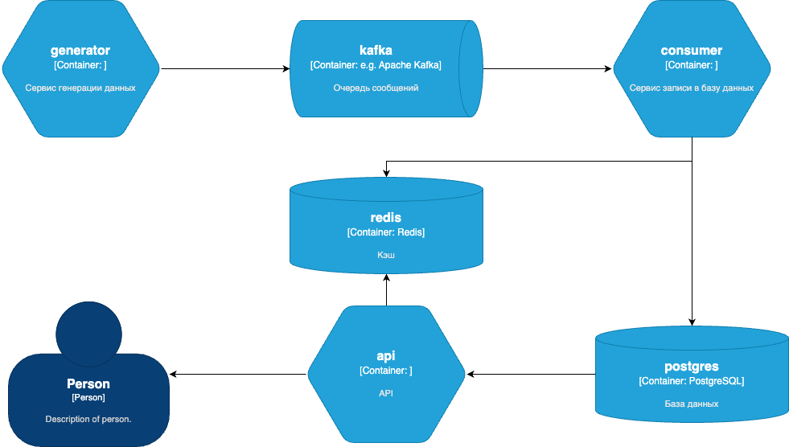
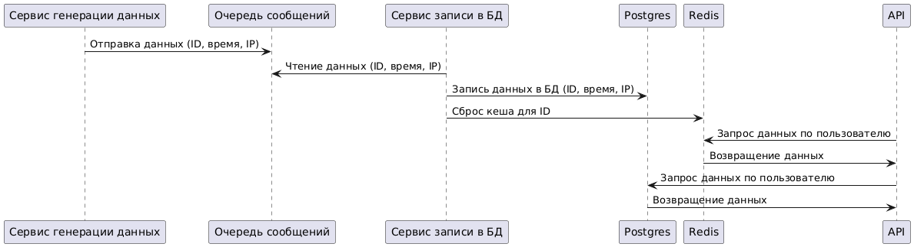

# Задача

Сервис для работы с пользователями и их IP адресов.
Сервис накапливает данные от источника событий о подключении пользователя со случайного IP адреса и сохраняет их в БД (
предпочтительно PostgreSQL). IP адреса в событии для каждого счета могут повторяться или могут быть новыми. Один
пользователь может подключаться с разных IP адресов, несколько пользователей могут подключаться с одного IP адреса.
Формат данных в событии (пользователь long, строка IP адреса) 100001, “127.0.0.1”

Сервис должен позволять:

- найти пользователей по начальной или полной части IP адреса (например, если в качестве строки поиска указать “31.214”,
  а у пользователя 1234567 зафиксированы ранее следующие IP ["31.214.157.141", "62.4.36.194"], то метод сервиса вернет
  список, в котором помимо прочих подходящих пользователей будет и 1234567)
- найти все накопленные IP адреса пользователя
- найти время и IP адреса последнего подключения пользователя

# Сервисы



- Сервис генерации данных (generator) — создает данные, содержащие ID пользователя, текущее время и IP-адрес, генерирует
  массив из 10 IPv6 и 10 IPv4 и рандомно раздает 10 пользователям.
- Очередь сообщений (kafka) — служит буфером для данных, созданных сервисом, перед их отправкой в базу данных.
- Сервис записи в базу данных (consumer) — забирает данные из очереди и записывает их в базу данных Postgres.
- База данных (postgres) — хранит данные о пользователях.
- API — предоставляет доступ к данным пользователей из базы данных через запросы.



# База данных


Для таблицы UserIPs применяем партиционирование по месяцам, за тестирование взято предыдущий год, текущий и следующий,
они же в свою очередь партиционируются на 10 партиций по хешу пользователя

Чтобы эффективно искать пользователей по начальной или полной части IP-адреса, как это указано в задании, искать
пользователей начальной части IP-адреса оптимально использовать GIN-индекс или pg_trgm.

В таблице Users храниться пользователь с его последним ip и временем входа, для поиска последнего входа пользователя, а
при вставке изменении данных данные будут триггером копироваться в UserIPs для накопления историчиских данных о
подключении пользователя.

# Собрать

```
docker compose build --no-cache
```

# Запустить

```
docker compose up -d
```

# Проверить в swagger

```
http://localhost:8080/swagger/index.html
```

# Остановить и удалить

```
docker compose down -v
```